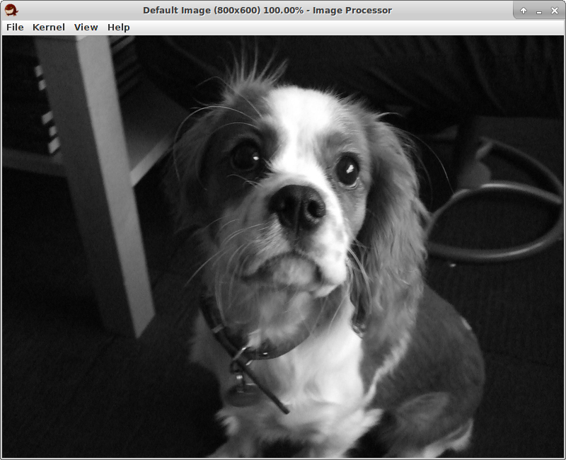

Image processor
===============

This is a basic image processing tool written in Java, which I developed as part of my Bachelor's coursework.
It only supports greyscale images.




Transformations
---------------

Supported transformations include:
- Inversion
- Contrast enhancement
- Smoothening
- Sharpening
- Edge detection (Sowel, Prewitt, Isotropic)
- Hough transform
- Rescaling


Running the program
-------------------
To run:

```bash
$ java -jar bin/imageProcessor.jar
```
